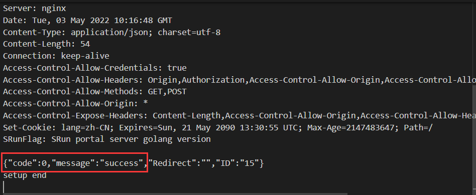

<h1 align="center">IPGW.ino</h1>
<h3 align="center">东北大学校园网关客户端的 ESP8266 单片机版本🦾（迫真</h3>

## 鸣谢
[neucn/ipgw](https://github.com/neucn/ipgw)

如果没有前辈的开源项目，理解 ipgw 的登录过程可能会变得更困难


## 使用方法
本仓库只有一个有效代码文件：ipgw.ino

将 ipgw.ino 第六行和第七行的 `YOUR_ID` 和 `YOUR_PASSWORD`

```
const String USERNAME = "YOUR_ID"; // 校园网用户名
const String PASSWORD = "YOUR_PASSWORD"; // 校园网密码
```

换成自己的学号和密码即可

由于 ESP8266 的性能限制，整个登录过程可能会持续 20s，期间程序将在串口监视器中打印当前正在进行的步骤。最后，如果在串口监视器中看到 `"code":0, "message":"success"` 的提示信息，说明 ipgw 认证成功




## 自我吐槽 

代码非常不整洁，欢迎 PR 优化